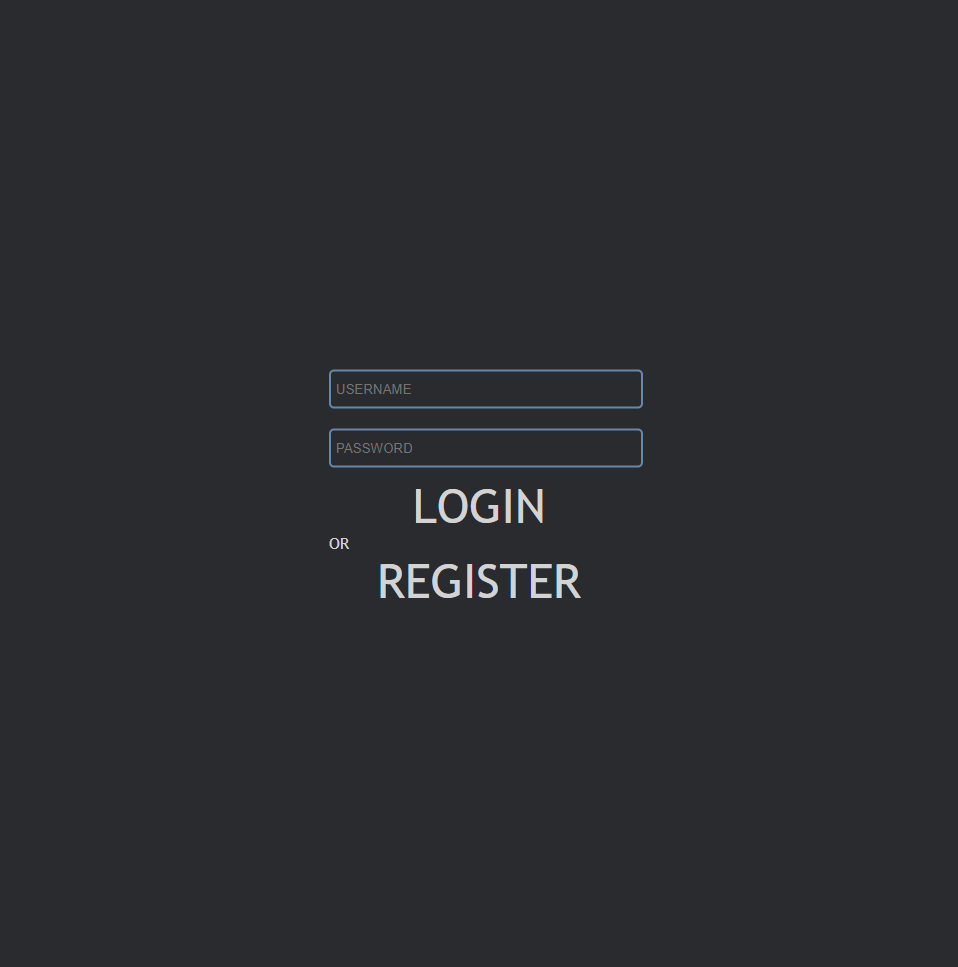
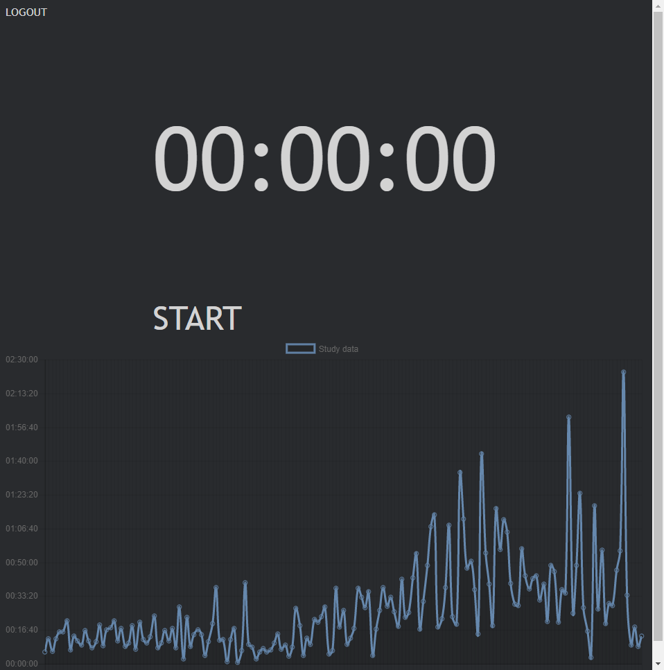

# study-timer

A timer webapp to help you study.

## Prerequisites

You will need [Leiningen][1] 2.0 or above installed.

[1]: https://github.com/technomancy/leiningen

## Running

To start a web server for the application, run:

    lein run

## Picture
### Login

### App

